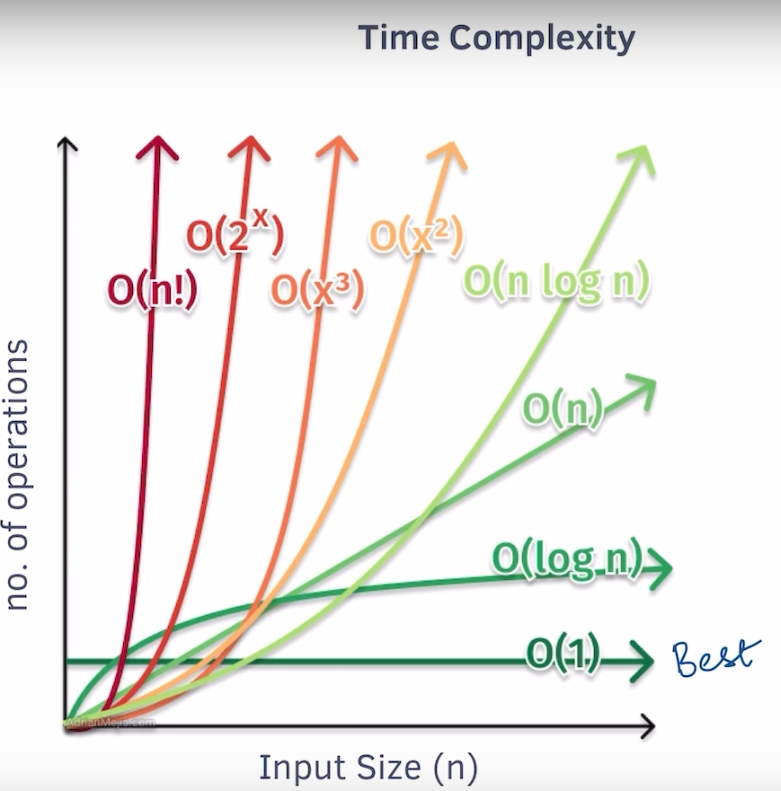
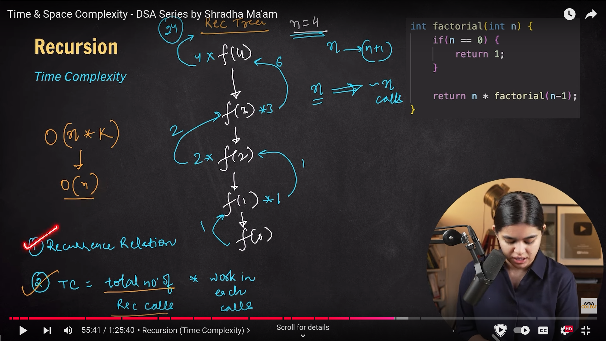
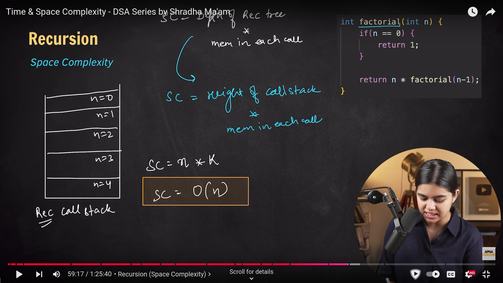
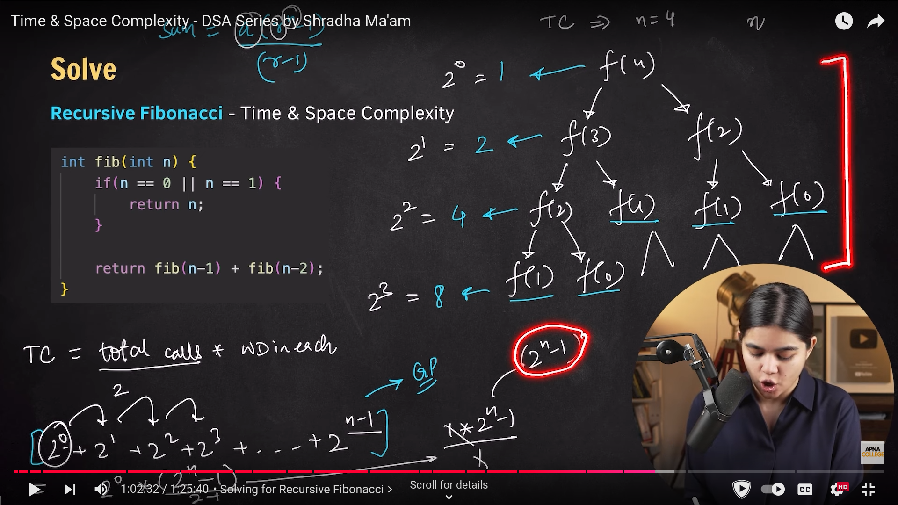
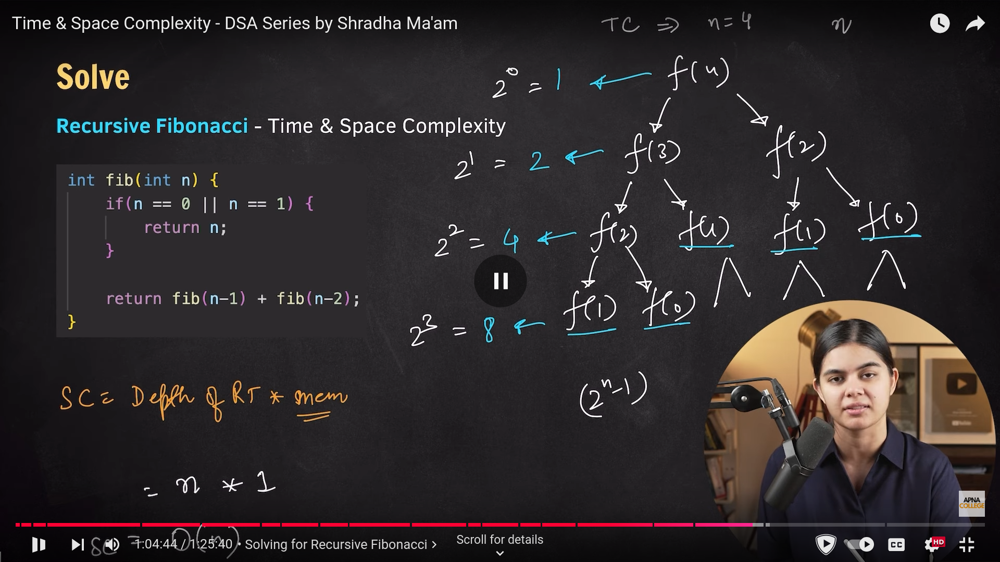
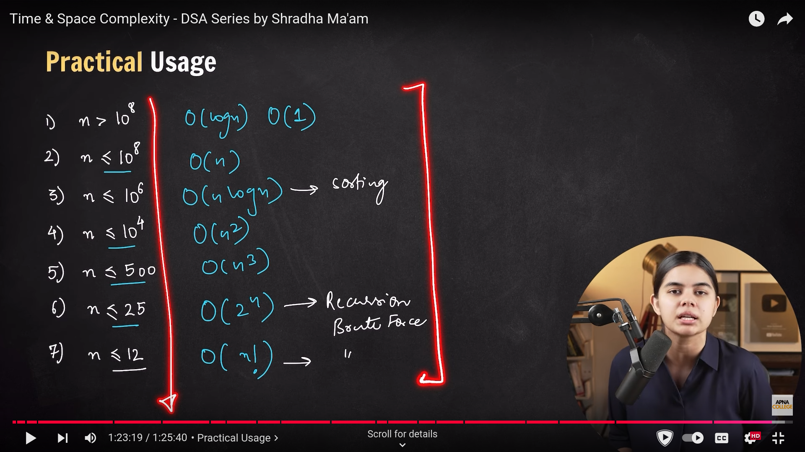

# Time and Space Complexity

- Time complexity measures the time an algorithm takes to run as a function of the input size (n). It tells us how the runtime of the algorithm grows as the input size increases. Time complexity is typically expressed using **Big O** notation, which provides an upper bound (worst case) on the growth rate.

- Space complexity measures the amount of memory an algorithm needs as a function of the input size (n). It accounts for the variables, data structures, and function calls used by the algorithm.

- Not the actual time taken but amount of time taken as function of input size(n).

## Notations

1. Big Ω --> Best Case (lower bound)
2. Big θ --> Average (tight bound)
3. Big O --> Wrost Case (upper bound)

## Common Time Complexities

1. **O(1) (Constant Time):** The algorithm takes the same amount of time regardless of the input size.

    **Example:** Accessing an element in an array.

2. **O(log n) (Logarithmic Time):** The algorithm reduces the problem size by half in each step, so the number of operations grows logarithmically.

    **Example:** Binary search in a sorted array.

3. **O(n) (Linear Time):** The algorithm's running time increases linearly with the input size.

    **Example:** A simple loop that iterates through all elements of an array.

4. **O(n log n):** The algorithm performs a linear amount of work but does so for logarithmic divisions of the input.

    **Example:** Merge sort or quicksort (in the average case).

5. **O($n^2$) (Quadratic Time):** The algorithm's runtime grows quadratically with the input size.
        **Example:** Nested loops, such as bubble sort.

6. **O($2^n$) (Exponential Time):** The algorithm's runtime doubles with every additional element in the input.

    **Example:** Recursive algorithms that solve problems by exploring all subsets (like the Fibonacci sequence via recursion).

Examples:

